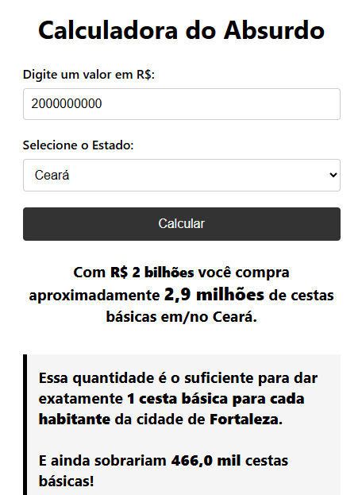

# Calculadora-do-absurdo
Ferramenta da disciplina de Metodologia Científica que converte montantes financeiros em cestas básicas, usando dados do IBGE. O objetivo é tornar valores enormes em algo tangível, conscientizando sobre o impacto real do dinheiro público desviado.

## Como funciona
A calculadora cruza o valor inserido com o custo médio da cesta básica regional e a população das cidades, traduzindo cifras abstratas em unidades de subsistência real.

## Tecnologias
- HTML5
- CSS3
- JavaScript (Busca Binária)
- JSON (Dados do IBGE)

## Objetivo
Transformar dados complexos em indicadores de fácil compreensão, permitindo que a sociedade visualize a dimensão social do que é perdido em casos de corrupção ou má gestão.
